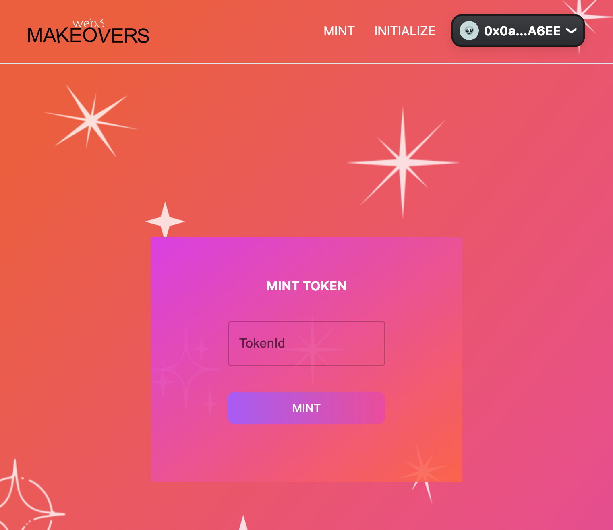

<h1 align='center'>

WEB3 MAKEOVERS

</h1>

This is a dApp that allows issuing NFTs and Soulbound tokens for the Web3MAKEOVERS project with a flexible and scalable management system. It is 100% decentralized, with even the frontend hosted on decentralized IPFS. No centralized servers. Welcome.

 

### Visit: [Web3MAKEOVERS](https://web3makeovers.on.fleek.co)

 

  
  

## Powered with:

*   
    

*   
    

*   
    

*   
    

*   
    

-   
    

-   
    

-   
    

-   
    

-   
    

-   
    

-   
    

-   
    

-   
    

-   
    

-   
    

-   
    
    
-   
    

-   
    

 

## Contract

| Chain   | Address                                                                                                                              |
| :------ | :----------------------------------------------------------------------------------------------------------------------------------- |
| Polygon | [0x21EE6708e1197429f44DE64e819fEC108E67790d](https://mumbai.polygonscan.com/address/0x21EE6708e1197429f44DE64e819fEC108E67790d#code) |
